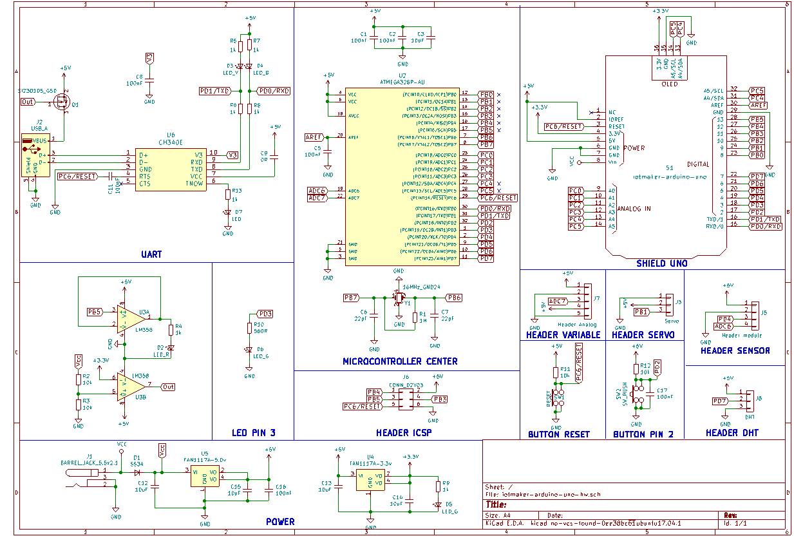
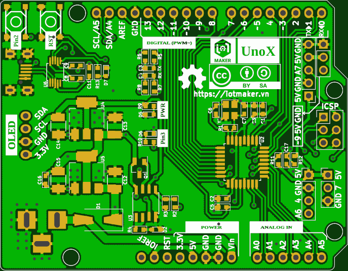
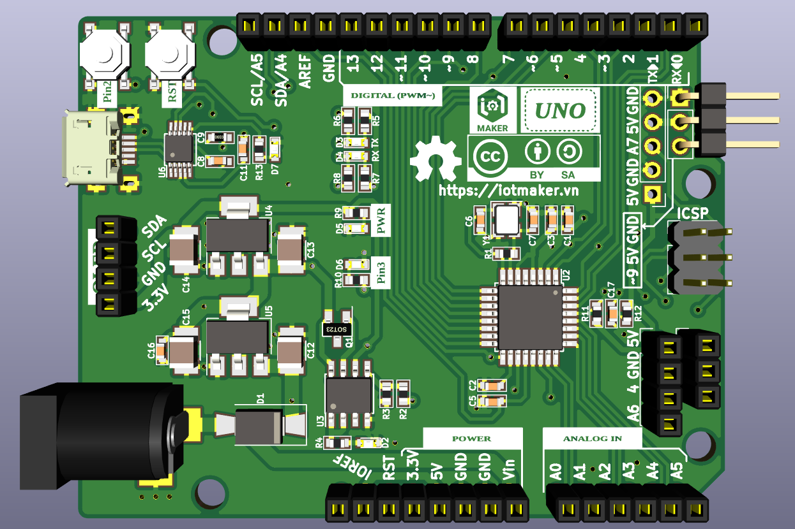
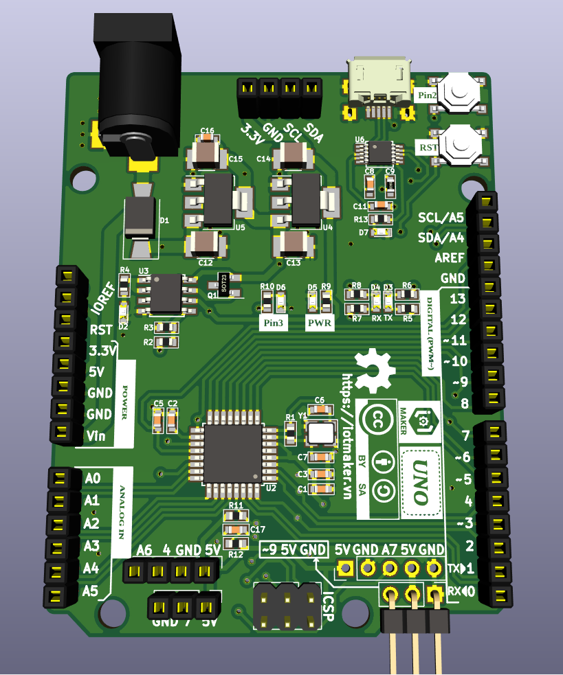

# iotmaker-arduino-uno-pcb

## Features

IoTMaker Arduino Uno:  
- Power input 6.5V to 12VDC - recomment 9V (1A/5V output) and 5V USB
- Additional Button, LED, header for external module : variable, servo, common sensor.
- Open hardware with CC-BY-SA license
- Design with KiCad

## Hardware

### Schematics

### PCB Layout

### 3D

### Pinout 

### Gerber

[Download gerber sigle](./assets/iotmaker-arduino-uno-68,58x53,34mm.zip)

[Download gerber 4panel](./assets/gerber-4panel.zip)

### Remark

This project was in development phase - we will remove this remark after release

# License

